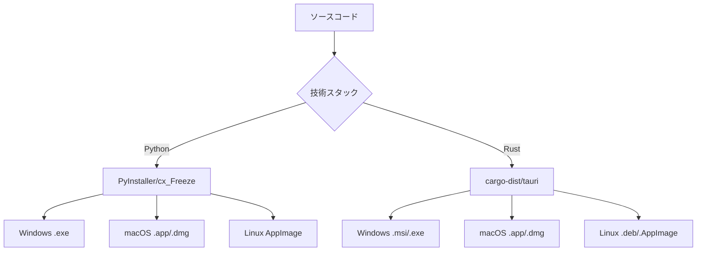

# ビルド・配布設計

## 1. 実行ファイル生成戦略

### 1.1 技術スタック選択とビルド方式

以下の技術スタックとビルド方式を推奨します：

#### 推奨技術スタック: Python + PySide6

**理由**:
- 豊富なメタデータ抽出ライブラリ（exifread, pillow, tinytag）
- 成熟したGUIフレームワーク（PySide6）
- 実行ファイル生成ツールの充実（PyInstaller, cx_Freeze）
- クロスプラットフォーム対応の容易性
- 開発・保守の効率性

#### 代替技術スタック: Rust + Tauri

**メリット**:
- 高いパフォーマンス
- 小さな実行ファイルサイズ
- メモリ安全性
- Web技術によるモダンなUI

### 1.2 実行ファイル生成戦略



## 2. プラットフォーム別実行ファイル仕様

### 2.1 Windows (x64)

**実行ファイル形式**:
- **メインアプリケーション**: `video-copy-tool.exe` (GUI+CUI統合)
- **CUI専用版**: `video-copy-tool-cli.exe` （オプション）
- **インストーラー**: `video-copy-tool-setup.exe` (Inno Setup/WiX)

**配布パッケージ**:
```
video-copy-tool-v1.0.0-windows-x64/
├── video-copy-tool.exe          # メインアプリケーション
├── README.txt
├── LICENSE.txt
├── config/
│   ├── default-presets.json
│   └── app-config.json
└── docs/
    └── user-guide.pdf
```

**技術仕様**:- **ターゲット**: Windows 10 1809+ (x64)- **ビルドツール**: PyInstaller + UPX圧縮- **サイズ目標**: 50MB以下（圧縮後）- **署名**: Code Signing証明書による署名- **レジストリ**: 必要最小限の登録項目**デバイス接続関連の依存関係**:- **MTPライブラリ**: Windows Media Format SDK- **USBドライバー**: WinUSB (通常はOS標準で利用可能)- **iOSサポート**: iTunes/Apple Mobile Device Support (ユーザーインストール推奨)- **権限**: デバイスアクセス権限の適切な要求

### 2.2 macOS (Universal Binary)

**実行ファイル形式**:
- **アプリケーションバンドル**: `Video Copy Tool.app`
- **DMGパッケージ**: `video-copy-tool-v1.0.0-macos.dmg`

**配布パッケージ構造**:
```
Video Copy Tool.app/
├── Contents/
│   ├── Info.plist
│   ├── MacOS/
│   │   └── video-copy-tool        # Universal Binary
│   ├── Resources/
│   │   ├── icon.icns
│   │   ├── config/
│   │   └── docs/
│   └── Frameworks/               # 必要な依存ライブラリ
```

**技術仕様**:- **ターゲット**: macOS 10.15+ (Intel/Apple Silicon)- **アーキテクチャ**: Universal Binary (x86_64 + arm64)- **ビルドツール**: PyInstaller + create-dmg- **署名**: Apple Developer証明書 + Notarization- **サンドボックス**: 必要に応じて対応**デバイス接続関連の依存関係**:- **iOSサポート**: libimobiledevice (Homebrewまたは静的リンク)- **MTPサポート**: libmtp (Android用)- **PTPサポート**: libgphoto2 (デジタルカメラ用)- **権限**: システム環境設定でのUSBアクセス許可- **エンタイトルメント**: `com.apple.security.device.usb` (必要に応じて)

### 2.3 Linux (AppImage)

**実行ファイル形式**:
- **AppImageファイル**: `video-copy-tool-v1.0.0-linux-x86_64.AppImage`
- **DEBパッケージ**: `video-copy-tool_1.0.0_amd64.deb` (将来版)

**AppImage構造**:
```
video-copy-tool.AppImage
├── AppRun                        # 起動スクリプト
├── video-copy-tool.desktop
├── video-copy-tool.png
└── usr/
    ├── bin/
    │   └── video-copy-tool
    ├── lib/                      # 依存ライブラリ
    └── share/
        └── video-copy-tool/
```

**技術仕様**:- **ターゲット**: Ubuntu 18.04+ / Debian 10+ (x86_64)- **ビルドツール**: PyInstaller + AppImageTool- **依存関係**: 最小限のシステム依存関係- **ポータビリティ**: 単一ファイルで動作**デバイス接続関連の依存関係**:- **MTPサポート**: libmtp12 (通常はOS標準で利用可能)- **PTPサポート**: libgphoto2-6 (デジタルカメラ用)- **iOSサポート**: libimobiledevice6 (要個別インストール)- **udev規則**: デバイス認識のためのudevルール設定- **権限**: ユーザーをplugdevグループに追加推奨

## 3. ビルドシステム設計

### 3.1 自動化されたビルドパイプライン

**GitHub Actions workflow例**:
```yaml
name: Build and Release

on:
  push:
    tags: ['v*']

jobs:
  build-windows:
    runs-on: windows-latest
    steps:
      - uses: actions/checkout@v4
      - name: Setup Python
        uses: actions/setup-python@v4
        with:
          python-version: '3.11'
      - name: Install dependencies
        run: |
          pip install -r requirements.txt
          pip install pyinstaller[encryption]
      - name: Build executable
        run: |
          pyinstaller --clean video_copy_tool.spec
      - name: Sign executable
        run: |
          signtool sign /f cert.p12 /p ${{ secrets.CERT_PASSWORD }} dist/video-copy-tool.exe
      - name: Create installer
        run: |
          iscc video-copy-tool.iss
      - name: Upload artifacts
        uses: actions/upload-artifact@v3

  build-macos:
    runs-on: macos-latest
    steps:
      - uses: actions/checkout@v4
      - name: Setup Python
        uses: actions/setup-python@v4
        with:
          python-version: '3.11'
      - name: Build Universal Binary
        run: |
          # Intel版とApple Silicon版を個別ビルド後、lipo コマンドで結合
          pyinstaller --target-arch x86_64 video_copy_tool.spec
          pyinstaller --target-arch arm64 video_copy_tool.spec
          lipo -create -output dist/video-copy-tool dist-x86_64/video-copy-tool dist-arm64/video-copy-tool
      - name: Create app bundle
        run: |
          create-dmg --volname "Video Copy Tool" dist/Video\ Copy\ Tool.app
      - name: Sign and notarize
        run: |
          codesign --deep --sign "${{ secrets.APPLE_CERT_ID }}" dist/Video\ Copy\ Tool.app
          xcrun notarytool submit dist/video-copy-tool.dmg --wait

  build-linux:
    runs-on: ubuntu-20.04
    steps:
      - uses: actions/checkout@v4
      - name: Setup Python
        uses: actions/setup-python@v4
        with:
          python-version: '3.11'
      - name: Install system dependencies
        run: |
          sudo apt-get update
          sudo apt-get install -y libxcb-xinerama0 libxcb-cursor0
      - name: Build AppImage
        run: |
          pyinstaller video_copy_tool.spec
          wget https://github.com/AppImage/AppImageKit/releases/download/continuous/appimagetool-x86_64.AppImage
          chmod +x appimagetool-x86_64.AppImage
          ./appimagetool-x86_64.AppImage AppDir video-copy-tool.AppImage
```

### 3.2 PyInstaller設定ファイル

**video_copy_tool.spec**:
```python
# -*- mode: python ; coding: utf-8 -*-
import sys
from pathlib import Path

# プラットフォーム固有の設定
if sys.platform == 'win32':
    icon_file = 'assets/icon.ico'
    console = False
elif sys.platform == 'darwin':
    icon_file = 'assets/icon.icns'
    console = False
else:  # Linux
    icon_file = 'assets/icon.png'
    console = False

a = Analysis(
    ['src/main.py'],
    pathex=[],
    binaries=[],
    datas=[
        ('config/*', 'config'),
        ('assets/*', 'assets'),
        ('docs/user-guide.pdf', 'docs'),
    ],
    hiddenimports=[
        'PIL._tkinter_finder',
        'exifread',
        'tinytag',
    ],
    hookspath=[],
    hooksconfig={},
    runtime_hooks=[],
    excludes=[
        'tkinter',
        'matplotlib',
        'numpy',  # 必要でない場合は除外
    ],
    win_no_prefer_redirects=False,
    win_private_assemblies=False,
    cipher=None,  # または暗号化キーを指定
    noarchive=False,
)

pyz = PYZ(a.pure, a.zipped_data, cipher=None)

exe = EXE(
    pyz,
    a.scripts,
    a.binaries,
    a.zipfiles,
    a.datas,
    [],
    name='video-copy-tool',
    debug=False,
    bootloader_ignore_signals=False,
    strip=False,
    upx=True,  # UPX圧縮を有効化
    upx_exclude=[],
    runtime_tmpdir=None,
    console=console,
    disable_windowed_traceback=False,
    target_arch=None,
    codesign_identity=None,
    entitlements_file=None,
    icon=icon_file,
    version='version_info.txt' if sys.platform == 'win32' else None,
)

# macOS用のアプリケーションバンドル
if sys.platform == 'darwin':
    app = BUNDLE(
        exe,
        name='Video Copy Tool.app',
        icon=icon_file,
        bundle_identifier='com.example.video-copy-tool',
        info_plist={
            'CFBundleDisplayName': 'Video Copy Tool',
            'CFBundleVersion': '1.0.0',
            'CFBundleShortVersionString': '1.0.0',
            'NSHighResolutionCapable': True,
            'LSMinimumSystemVersion': '10.15.0',
            'NSCameraUsageDescription': 'This app needs camera access to process photos.',
            'NSPhotoLibraryUsageDescription': 'This app needs photo library access to organize photos.',
        },
    )
```

## 4. 配布戦略

### 4.1 リリースチャネル

**1. GitHub Releases** (主要配布チャネル)
- 各プラットフォーム用のバイナリ
- チェックサム (SHA256) 付き
- リリースノート付き

**2. パッケージマネージャー**
```bash
# Windows (Chocolatey)
choco install video-copy-tool

# macOS (Homebrew)
brew install --cask video-copy-tool

# Linux (Snap/Flatpak - 将来版)
snap install video-copy-tool
flatpak install video-copy-tool
```

**3. 公式サイト**
- 直接ダウンロードリンク
- インストール手順
- システム要件

### 4.2 アップデート機能

**自動アップデート機能**:
```python
class UpdateChecker:
    def __init__(self):
        self.current_version = "1.0.0"
        self.update_url = "https://api.github.com/repos/user/video-copy-tool/releases/latest"
    
    async def check_for_updates(self) -> Optional[UpdateInfo]:
        # GitHub API経由で最新バージョンをチェック
        # セキュアな自動アップデート機能
        pass
    
    def download_and_install_update(self, update_info: UpdateInfo):
        # プラットフォーム固有のアップデート処理
        pass
```

## 5. 品質保証・テスト

### 5.1 自動テスト

**ビルド品質チェック**:
```bash
# 実行ファイルのテスト
./video-copy-tool --version
./video-copy-tool --help
./video-copy-tool --validate-config sample-config.json

# 基本機能テスト
./video-copy-tool --dry-run --source test-data --destination temp-output
```

**パフォーマンステスト**:
- 起動時間: 3秒以内
- メモリ使用量: 100MB以内 (アイドル時)
- 大量ファイル処理: 1000ファイル/10分以内

### 5.2 手動テスト項目

**プラットフォーム別テスト**:
- [ ] Windows: スタートメニュー統合、ファイル関連付け
- [ ] macOS: Launchpad表示、Gatekeeper通過
- [ ] Linux: デスクトップ統合、権限管理

## 6. セキュリティ・証明書管理

### 6.1 コード署名

**Windows**:
- Extended Validation (EV) Code Signing証明書
- SmartScreen Filter対応
- タイムスタンプサーバー使用

**macOS**:
- Apple Developer ID証明書
- Notarization (公証) 必須
- Hardened Runtime有効化

### 6.2 セキュリティ機能

**実行時セキュリティ**:
- ASLR (Address Space Layout Randomization) 有効
- DEP (Data Execution Prevention) 有効
- ウイルススキャナー除外申請

**依存関係セキュリティ**:
- 定期的な依存関係脆弱性スキャン
- Dependabot による自動更新
- SBOM (Software Bill of Materials) 生成

## 7. 配布パッケージサイズ最適化

### 7.1 サイズ削減技術

**Python実行ファイル最適化**:
```python
# PyInstallerオプション
--exclude-module tkinter
--exclude-module matplotlib
--strip                    # デバッグシンボル削除
--upx-dir=/path/to/upx     # UPX圧縮
--clean                    # ビルドキャッシュクリア
```

**依存関係最適化**:
- 必要最小限のライブラリのみ含める
- 動的ライブラリの共有化
- オンデマンドロード

### 7.2 目標サイズ

| プラットフォーム | 目標サイズ | 実用サイズ上限 |
|----------------|-----------|---------------|
| Windows .exe   | 40MB      | 80MB          |
| macOS .dmg     | 45MB      | 90MB          |
| Linux AppImage | 35MB      | 70MB          |

この設計により、高品質で保守しやすい実行ファイルの生成・配布システムが構築できます。 